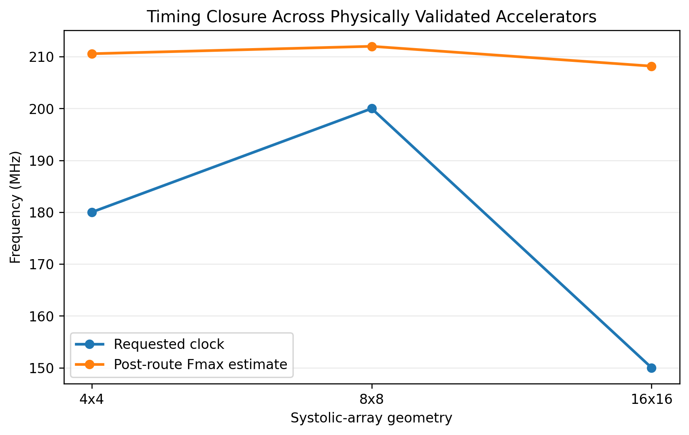
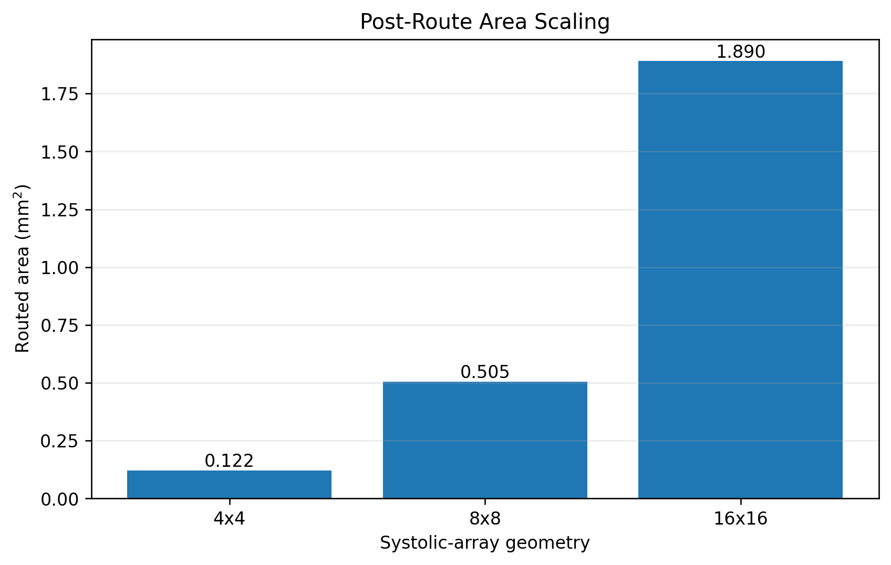

# AccelClosure

### Agentic Prompt-to-Silicon Design Closure for AI Accelerators

**Generate. Verify. Measure. Redesign. Close. Explain.**

**Designed and developed by Talha Alam**

AccelClosure is an agentic hardware co-design framework for configurable
systolic-array AI accelerators.

It transforms a high-level hardware request into a structured architecture,
generates and verifies RTL, evaluates the implementation using real EDA tools,
analyzes timing and physical-design failures, performs architecture-aware
redesign, and uses real AI workloads to help select an accelerator
configuration.

AccelClosure is built around the CHIA agentic hardware/software co-design
framework.

## At a Glance

| Capability | Current State |
|---|---|
| Agentic orchestration | CHIA + Gemini through Google Vertex AI |
| Autonomous hardware backend | Square WS INT8 systolic arrays |
| RTL verification | Verilator |
| Synthesis / STA | Yosys + implementation timing flow |
| Physical implementation | OpenROAD / OpenROAD-flow-scripts + Sky130HD |
| Physically closed references | 4x4, 8x8, 16x16 WS INT8 |
| Fresh scalability evidence | 32x32 WS INT8 through verified synthesis and pre-layout timing closure |
| Real-model evaluation | TinyBERT, TinyLlama, Qwen2.5 |
| Final layout inspection | KLayout |

## System Architecture

<p align="center">
  
</p>

<p align="center"><em>AccelClosure closed-loop architecture connecting natural-language design intent, agentic reasoning, RTL generation, verification, EDA-driven optimization, physical implementation, and implementation evidence.</em></p>

### One-Command Prompt-to-GDS Flow

```bash
./bin/accelclosure run \
  "Design an 8x8 INT8 weight-stationary systolic array targeting Sky130 at 180 MHz" \
  --open
```

The command drives the complete autonomous flow. After successful physical closure, `--open` validates the final artifact and launches the generated GDSII in KLayout.

**Research figures:** 
[System Architecture](docs/diagrams/fig01_accelclosure_system_architecture.pdf) · 
[Agentic Timing Closure](docs/diagrams/fig02_agentic_timing_closure_loop.pdf) · 
[Design-Space & Evidence Model](docs/diagrams/fig03_design_space_evidence_model.pdf) · 
[Evidence & Provenance](docs/diagrams/fig04_evidence_provenance_pipeline.pdf)

**Documentation:** [Architecture](docs/ARCHITECTURE.md) · [Experimental Evidence](evidence/README.md)

---

## Core Idea

Traditional prompt-to-RTL systems mainly ask:

> Can an LLM generate Verilog?

AccelClosure goes further:

> Can an intelligent agent generate accelerator hardware, verify it, measure
> the implementation, understand why it fails, redesign the architecture,
> physically close it, and explain the resulting hardware tradeoffs?

The EDA tools remain the source of truth.

---

## Accelerator Design Space

AccelClosure is not restricted to the three array sizes used in the current
physical demonstrations.

The product architecture treats accelerator parameters as independent design
dimensions.

### Geometry

Current product design-space scope: 2x2 through 128x128.

Both square and rectangular systolic arrays are represented.

Example configurations include 4x4, 8x8, 16x16, 32x32, 64x64, 128x128,
8x16, 16x32, and 32x64.

### Dataflows

AccelClosure models the major systolic-array dataflows:

- WS - Weight Stationary
- OS - Output Stationary
- IS - Input Stationary

Current backend maturity:

| Dataflow | Status |
|---|---|
| WS | Implemented reference backend |
| OS | Architecture plugin extension |
| IS | Architecture plugin extension |

### Arithmetic

The product design space includes:

- INT4
- INT8
- INT16
- BF16

The currently validated implementation backend uses signed INT8 activation
and weight operands with INT32-compatible accumulation.

Other arithmetic formats are extension backends and require their own RTL,
verification, and EDA evidence before physical claims are made.

---

## Evidence Policy

AccelClosure strictly separates product design-space capability from measured
physical evidence.

For example, a 128x128 WS INT8 accelerator is a valid design-space request,
but its PPA cannot be inferred from a smaller accelerator.

Likewise, a 64x64 OS INT8 request is recognized by the design-space planner,
but the OS architecture backend must first be implemented and verified.

AccelClosure never copies timing, area, or power results between different
array geometries, dataflows, arithmetic configurations, or clock targets.

---

## Physically Validated Reference Designs

The current frozen physical evidence covers three WS INT8 square systolic arrays.

| Array | Target Clock | Post-route Fmax Estimate | Routed Area | Vectorless Power |
|---|---:|---:|---:|---:|
| 4x4 | 180 MHz | 210.57 MHz | 0.121669 mm2 | 0.0795 W |
| 8x8 | 200 MHz | 212.00 MHz | 0.505428 mm2 | 0.3570 W |
| 16x16 | 150 MHz | 208.18 MHz | 1.890364 mm2 | 1.2800 W |

All three reference implementations have:

- zero reported setup violations,
- zero reported hold violations,
- routed physical implementations,
- generated GDS artifacts,
- frozen evidence records.

Power values are ORFS vectorless estimates and are not workload-activity
qualified measurements.

Generated GDS does not imply foundry signoff or tapeout readiness.

<p align="center">
  
  
</p>

<p align="center"><em>Measured post-route frequency and routed-area evidence for the physically validated accelerator references.</em></p>

### Fresh Autonomous Prompt-to-GDS Demonstration

A fresh 8x8 WS INT8 request targeting Sky130 at 180 MHz was executed through the public autonomous flow. The run completed physical implementation with a post-route Fmax estimate of **208.95 MHz**, **+0.77 ns** worst setup slack, **0.497935 mm2** routed area, and **0.317 W** vectorless power. The retained run reports zero setup violations, zero hold violations, and zero route DRC violations.

This run is important because it demonstrates the complete user-facing path from a new natural-language request to independently generated implementation evidence and a final GDSII artifact.

### 32x32 Scalability Evidence

A fresh natural-language 32x32 WS INT8 request targeting 150 MHz successfully progressed through design-contract generation, RTL generation, functional verification, synthesis, and pre-layout STA.

The generated implementation met the requested pre-layout timing target with **+2.48 ns setup slack** and an estimated **238.99 MHz Fmax** before entering physical implementation.

The physical run was intentionally stopped during placement. Therefore, AccelClosure makes **no post-route or GDSII claim for the 32x32 configuration**.

---

## Agentic Design Closure

AccelClosure treats implementation failure as architectural feedback.

A timing failure can trigger the following loop:

1. Measure the timing violation.
2. Inspect the critical path.
3. Classify the failure.
4. Select an architecture change.
5. Regenerate or modify the RTL.
6. Re-run functional verification.
7. Re-run synthesis and STA.
8. Continue to physical implementation only after correctness is preserved.

Typical timing-driven redesign actions include:

- input boundary registers,
- registered PE-to-PE communication,
- a registered multiplication stage,
- a registered accumulation stage,
- deeper pipelining when required by STA.

The requested clock is not silently relaxed to make a design appear successful.

---

## Real Transformer Workload Evaluation

AccelClosure evaluates physically closed accelerator candidates using real
Transformer workload dimensions.

Current benchmark models:

- TinyBERT-4L-312D
- TinyLlama-1.1B
- Qwen2.5-1.5B

Workload classes include:

- Transformer encoder,
- LLM prefill,
- token-by-token LLM decode.

The workload model includes major GEMM operations such as Q, K, V and output
projections, attention matrix multiplications, and feed-forward projections.

There is no single universally optimal array size.

For the tested dense encoder and prefill workloads, 16x16 provides the lowest
projected compute latency.

For area-normalized dense throughput, 8x8 is often the strongest tested candidate.

For token-by-token decode with M=1, utilization becomes:

- 4x4: 25.00%
- 8x8: 12.50%
- 16x16: 6.25%

Therefore the 4x4 design provides the strongest area-normalized efficiency
among the currently validated candidates for the tested decode workload.

---

## Real Model Tensor Validation

AccelClosure also evaluates actual trained model weights and real model activations.

| Model | Selected GEMM | Exact INT32 Across 4x4 / 8x8 / 16x16 |
|---|---:|---|
| TinyBERT | 16x312x64 | PASS |
| TinyLlama | 16x2048x64 | PASS |
| Qwen2.5-1.5B | 16x1536x64 | PASS |

Cosine similarity after the simple symmetric INT8 quantization experiment:

- TinyBERT: 0.993507
- TinyLlama: 0.997716
- Qwen2.5-1.5B: 0.992100

This validates mapping of real Transformer tensors using software-tiled
INT8/INT32 execution.

It does not claim complete end-to-end Transformer RTL inference.

---

## Unified Command-Line Interface

AccelClosure exposes one public command-line interface:

```bash
./bin/accelclosure --help
```

Available commands:

- `run` - execute the autonomous accelerator flow,
- `plan` - explore the broader accelerator design space,
- `advise` - select hardware for a real-model workload,
- `demo` - run the presentation-facing demonstration,
- `status` - show implementation and evidence maturity,
- `explain` - explain why a hardware configuration was selected.

### Check Product Status

```bash
./bin/accelclosure status
```

### Plan a New Accelerator

Example 128x128 WS INT8 request:

```bash
./bin/accelclosure plan \
  --rows 128 \
  --columns 128 \
  --dataflow ws \
  --arithmetic int8 \
  --frequency 150 \
  --objective balanced
```

Example 64x64 OS INT8 request:

```bash
./bin/accelclosure plan \
  --rows 64 \
  --columns 64 \
  --dataflow os \
  --arithmetic int8 \
  --frequency 180 \
  --objective latency
```

The planner reports whether physical evidence already exists or whether a new
architecture backend, verification run, and EDA implementation are required.

### Run the Autonomous Hardware Flow

```bash
./bin/accelclosure run \
  "Design an 8x8 INT8 weight-stationary systolic array targeting Sky130 at 180 MHz" \
  --open
```

The currently implemented autonomous RTL-to-GDS backend targets square WS INT8 systolic arrays.

`--open` is optional. When requested, AccelClosure launches the validated final GDSII in KLayout only after the complete physical flow succeeds.

### Workload-Aware Recommendation

```bash
./bin/accelclosure advise \
  --model tinyllama \
  --scenario decode \
  --objective area
```

### Explain the Hardware Decision

```bash
./bin/accelclosure explain \
  --model tinyllama \
  --scenario decode \
  --objective area
```

### Presentation Demo

```bash
./bin/accelclosure demo \
  --model tinyllama \
  --scenario decode \
  --objective area
```

The demo presents the physical candidates, real-model evidence, workload
comparison, selected hardware, and the reason behind the recommendation.

---

## Main Project Components

```text
AccelClosure/
|-- agents/
|   |-- design_contract_agent.py
|   |-- rtl_generator_agent.py
|   `-- timing_closure_agent.py
|
|-- src/
|   |-- request_frontend.py
|   |-- run_context.py
|   |-- reference_registry.py
|   |-- rtl_policy_gate.py
|   |-- verification_stage.py
|   |-- implementation_context.py
|   |-- eda_artifact_adapter.py
|   |-- orchestrator.py
|   |-- design_space_planner.py
|   |-- workload_advisor.py
|   |-- demo_presenter.py
|   `-- accelclosure_cli.py
|
|-- tests/
|-- scripts/
|-- configs/
|-- results/
|-- docs/
`-- bin/
    `-- accelclosure
```

## Toolchain

AccelClosure integrates:

- CHIA,
- Gemini through Google Vertex AI,
- OpenCode,
- Verilator,
- Yosys,
- OpenROAD and OpenROAD-flow-scripts,
- Sky130HD,
- KLayout,
- PyTorch,
- Hugging Face Transformers.

---

## Reproducibility

Each autonomous design execution uses a unique run identifier.

Run evidence can include:

- the original user request,
- the structured design contract,
- golden-reference provenance,
- generated RTL and RTL hashes,
- functional-verification results,
- synthesis and STA evidence,
- physical-implementation evidence,
- post-route timing and area,
- GDS hashes,
- benchmark inputs and outputs.

The final real-model benchmark evidence is frozen using SHA-256 manifests.

---

## Claim Discipline

AccelClosure follows strict evidence rules:

1. EDA evidence is authoritative.
2. PPA is never copied between different hardware configurations.
3. New RTL must pass functional verification.
4. Timing-driven architecture changes require reverification.
5. Requested clocks are not silently relaxed.
6. Workload latency estimates are clearly identified as projections.
7. Vectorless power is not presented as workload-measured power.
8. Generated GDS is not described as foundry signoff.
9. Product design-space support is not presented as physical validation.

---

## Project Vision

AccelClosure is designed to evolve into a general agentic accelerator-design
system where array geometry, dataflow, precision, pipeline architecture,
technology, AI workload, and optimization objective are explicit design
dimensions.

The goal is for an engineer to describe the accelerator they need and receive
not merely RTL, but a verified and implementation-aware architecture together
with evidence explaining why the final hardware was selected.

---

## Author

**Talha Alam**

Designer and developer of **AccelClosure**.

AccelClosure was developed as an agentic AI-accelerator hardware co-design
project using the CHIA framework.
