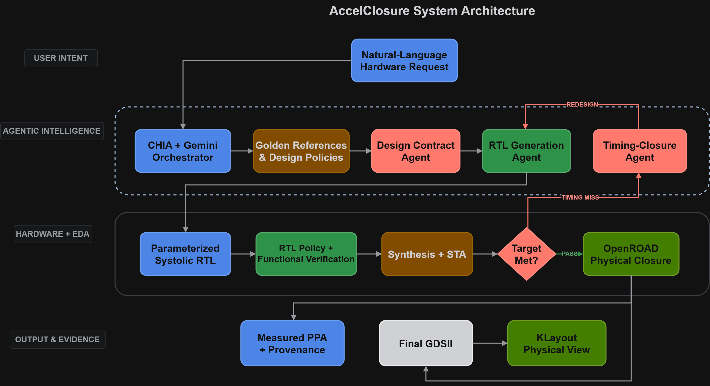
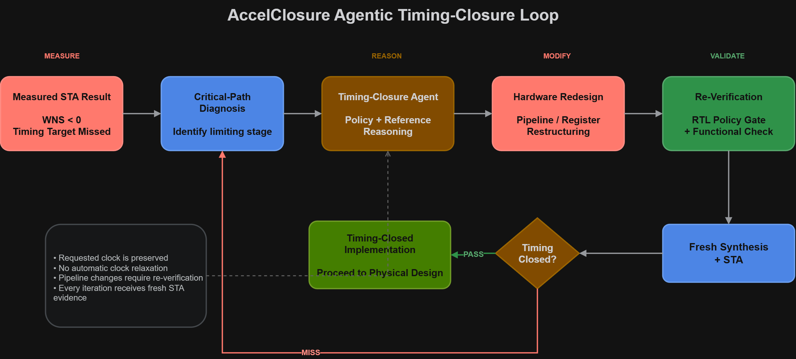
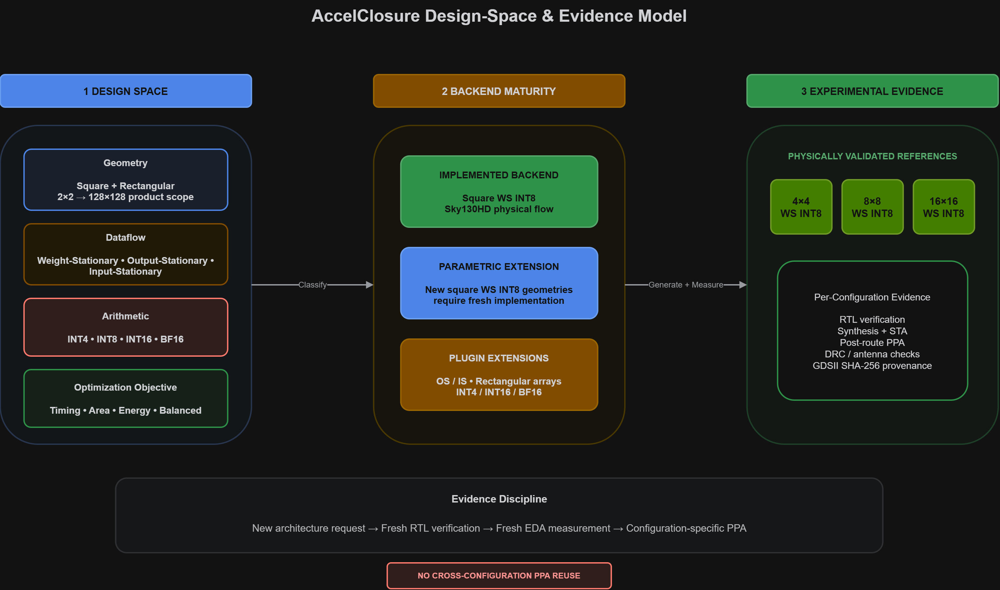
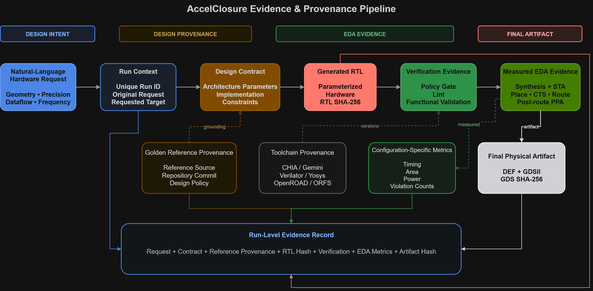

# AccelClosure Architecture

**Designed and developed by Talha Alam**

AccelClosure is a closed-loop agentic hardware co-design framework for systolic AI accelerators. Verification and EDA results are treated as design feedback: generated hardware is measured, implementation failures are diagnosed, and architecture changes are re-verified before the flow proceeds.

---

## 1. System Architecture

AccelClosure connects natural-language design intent to a physically implemented accelerator through CHIA/Gemini orchestration, grounded design policies, RTL generation, verification, synthesis and static timing analysis, agentic timing closure, and OpenROAD physical implementation.

  

[**Open high-resolution Figure 1 (PDF)**](diagrams/fig01_accelclosure_system_architecture.pdf)

*Figure 1. System-level architecture of AccelClosure, showing the agentic intelligence layer, hardware and EDA backend, timing-feedback loop, and final physical-design evidence.*

The major stages are:

- natural-language hardware request,
- CHIA and Gemini agent orchestration,
- golden-reference and design-policy grounding,
- structured design-contract generation,
- parameterized accelerator RTL generation,
- RTL policy and functional verification,
- synthesis and static timing analysis,
- agentic timing closure,
- OpenROAD physical implementation,
- final PPA and physical-artifact evidence.

The EDA backend remains the source of truth for implementation claims.

---

## 2. Agentic Timing Closure

AccelClosure treats a timing failure as architectural feedback rather than as a reason to silently relax the requested clock constraint.

  

[**Open high-resolution Figure 2 (PDF)**](diagrams/fig02_agentic_timing_closure_loop.pdf)

*Figure 2. Evidence-driven timing-closure loop. Measured STA failure is diagnosed, translated into an architecture change, functionally re-verified, and evaluated again using fresh synthesis and timing evidence.*

A timing miss can trigger:

1. measured STA failure analysis,
2. critical-path diagnosis,
3. timing-closure policy and reference reasoning,
4. architecture or pipeline redesign,
5. RTL policy and functional re-verification,
6. fresh synthesis and STA,
7. physical implementation only after the required evidence gate is satisfied.

Typical timing-driven transformations include input boundary registers, registered PE-to-PE communication, separated multiplication and accumulation stages, and deeper pipelining when required by STA.

The requested clock target is preserved throughout the closure process.

---

## 3. Accelerator Design Space and Backend Maturity

AccelClosure represents accelerator architecture as a set of explicit design dimensions rather than assuming one fixed systolic-array implementation.

  

[**Open high-resolution Figure 3 (PDF)**](diagrams/fig03_design_space_evidence_model.pdf)

*Figure 3. Separation between the broader accelerator design space, current backend implementation maturity, and configurations supported by measured physical evidence.*

### Geometry

- product design-space scope from 2x2 through 128x128,
- square and rectangular geometries are represented.

### Dataflow

- WS — Weight Stationary,
- OS — Output Stationary,
- IS — Input Stationary.

### Arithmetic

- INT4,
- INT8,
- INT16,
- BF16.

### Optimization Objective

- latency,
- area,
- energy,
- balanced.

### Technology

The currently validated physical backend targets Sky130HD. Additional physical technologies are treated as backend extensions.

### Current Implementation Maturity

| Architecture Capability | Current Status |
|---|---|
| Square WS INT8 | Implemented backend |
| OS | Architecture plugin extension |
| IS | Architecture plugin extension |
| Rectangular geometry | Geometry plugin extension |
| INT4 | Arithmetic plugin extension |
| INT16 | Arithmetic plugin extension |
| BF16 | Arithmetic plugin extension |

The physically validated reference set currently contains 4x4, 8x8, and 16x16 WS INT8 accelerators.

These reference implementations provide measured physical evidence and reusable architectural knowledge. Their PPA values are not reused to claim results for a different hardware configuration.

Product design-space capability therefore remains explicitly separated from experimentally validated implementation evidence.

---

## 4. Evidence and Provenance

Every autonomous AccelClosure run is treated as an independent evidence-producing experiment.

A new combination of architecture, clock target, dataflow, precision, or physical backend must establish its own verification and EDA evidence before physical PPA claims are made.

  

[**Open high-resolution Figure 4 (PDF)**](diagrams/fig04_evidence_provenance_pipeline.pdf)

*Figure 4. Run-level evidence lineage from the original natural-language request through design contract, reference grounding, generated RTL, verification, EDA measurement, and final physical-artifact integrity records.*

A run record can preserve:

- original natural-language request,
- requested architecture and target,
- unique run identity,
- structured design contract,
- golden-reference provenance,
- generated RTL and RTL hashes,
- RTL policy-gate results,
- functional-verification evidence,
- synthesis and STA evidence,
- physical-implementation evidence,
- post-route timing, area, and power,
- DEF and GDSII artifact identity,
- SHA-256 integrity records.

The core evidence rule is:

> **New configuration → fresh verification → fresh EDA measurement → configuration-specific PPA**

This prevents physical results from one accelerator configuration from being presented as measured results for another configuration.

---

## 5. Physical Implementation and Inspection

AccelClosure separates physical implementation from final layout inspection.

| Stage | Tool / Role |
|---|---|
| RTL verification | Verilator |
| Logic synthesis | Yosys |
| Physical implementation | OpenROAD / OpenROAD-flow-scripts |
| Technology backend | Sky130HD |
| Final GDSII inspection | KLayout |

OpenROAD performs the physical-design stages used by AccelClosure, including floorplanning, placement, clock-tree synthesis, routing, and implementation analysis.

KLayout provides final GDSII visualization and inspection after the physical artifact has been generated and validated by the AccelClosure evidence flow.

The project exposes these environments through its own workflow while retaining the pinned implementation environment used to produce the measured results.

Generated GDSII is retained as implementation evidence. It is not presented as foundry signoff or tapeout readiness.

---

## Architectural Principle

AccelClosure is organized around one central rule:

> **The EDA tools are the source of truth.**

The agents can reason about architecture, select transformations, generate RTL, and respond to implementation failures. Successful hardware claims, however, are tied to the verification and EDA evidence produced for that specific implementation.

This distinction allows AccelClosure to remain both agentic and experimentally grounded.
